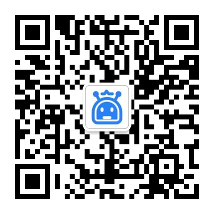

> **WorkBot** 一款安全稳定**零封号**的微信/企微RPA机器人，支持通过 API 控制**企微/微信**来实现聚合聊天、自动回复、群发消息、自动通过好友、定时发布朋友圈、单向好友检测清理等，如果您有本软件还不能满足的功能需求，请加我们的官方客服微信反馈，有问必答！

> 本工具所有技术实现均基于 **Android官方系统SDK** 和 **企微/微信官方SDK**，原理上保证本工具的合法合规性，请勿用于非法用途，一经发现立即封停！

### 本程序分为安卓端 APP 和任务调度平台

- 安卓端 APP 需要您 **自己提供一台手机**（需可运行企微/微信，手机型号和系统版本不限，本软件兼容 99% 的安卓手机）。
- 如果您是 **技术 / 开发者**
    - 可以自行编译源码运行，进行测试和学习
- 如果您 **不熟悉相关项目语言**
    - 可使用WorkBot打包版本：[点击下载](https://pan.quark.cn/s/20c0373dd2e4)
- 如果您是 **业务负责人 / 老板**
    - 可联系WorkBot官方客服协助你演示功能与技术对接
    - 

### 风险提示

- 本 APP 采用 Google 安卓系统的 **官方无障碍服务**，并在此基础上 **自研自动化框架，无 hook 函数、无侵入、无破坏、无内存修改，与 PC 端 RPA 完全不同**，手机无需破解 Root 权限，兼容绝大部分机型，支持长时间运行稳定。工信部发文要求各大 APP 必须进行无障碍改造，这是 **政府和官方支持的唯一自动化方案**，请拒绝黑产，拒绝影响微信生态的任何行为，鼓励无障碍服务改造！[点进跳转工信部文章链接](https://www.cnii.com.cn/zcjd/202012/t20201228_243049.html)
- 如果您的使用场景对信息极为敏感，数据独立隔离或有其他定制需求，可以提交 [定制申请](https://workbot.run) 获取更高级数据安全方案。
- 如果您的账号曾有被封或禁言等行为，请勿使用本工具！如您的行为违反 **腾讯运营规范** 或 **国家法律规定**，请勿使用本工具！[点进跳转企业微信安全指南链接](https://open.work.weixin.qq.com/help2/pc/cat?person_id=1&is_tencent=&doc_id=14664)

### 文档

这里有所有详细的API文档和调用示例！！！

这里有所有详细的API文档和调用示例！！！

这里有所有详细的API文档和调用示例！！！

📝 https://www.workbot.run

### 部分功能演示

#### 发送消息

注：Gif动图为机器人自动运行

#### 发送图片

  

注：Gif动图为机器人自动运行

### Copyright 版权

本产品采用 GPL-V2 许可证

基于Mozilla Public License Version 2.0并附加以下条款：
- **非商业性使用** — 不得将此项目及其衍生的项目的源代码和二进制产品用于任何商业和盈利用途

### 联系方式

- ⭐️ 合作申请: https://www.workbot.run
- 💻 Email: support@workbot.run
- 🤗 官方客服: 技术支持、问题反馈

